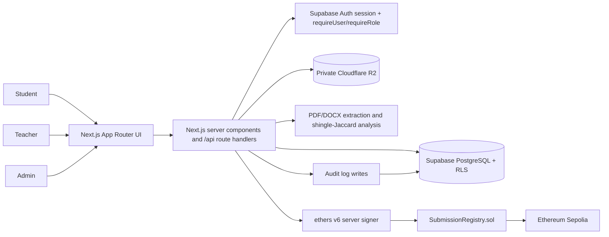
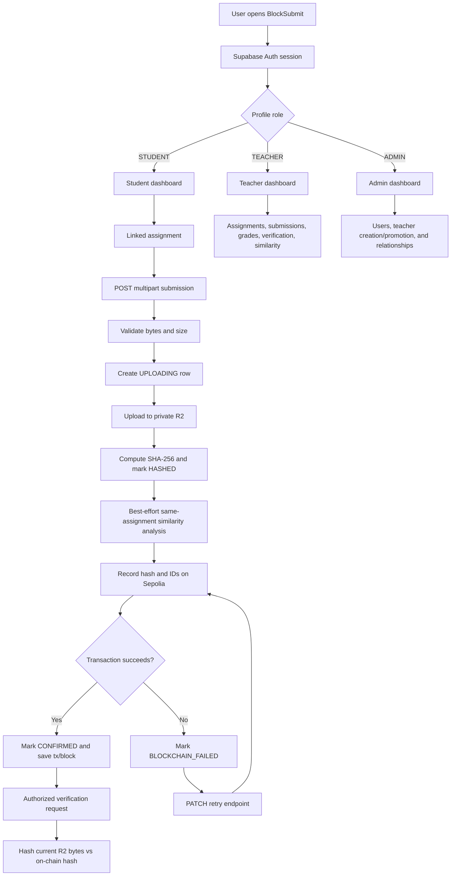

# BlockSubmit
BlockSubmit is a Next.js academic submission platform that stores documents privately, records server-generated integrity fingerprints on Ethereum Sepolia, and provides role-controlled submission, grading, verification, audit, and similarity workflows.
## 1. Introduction
- BlockSubmit lets students submit assignments and lets teachers review and grade them through role-protected workspaces.
- Files remain private in Cloudflare R2 while SHA-256 fingerprints and identifying metadata provide integrity evidence on Ethereum Sepolia.
- The platform combines Next.js, Supabase Auth/PostgreSQL/RLS, server-side validation, private storage, Solidity, and similarity analysis.
## 2. Key Features
### Authentication and authorization
- Supabase Auth manages sessions and middleware refreshes session cookies. New users receive the `STUDENT` role, while `requireUser`, `requireRole`, and RLS enforce access.
### Assignment and submission management
- Teachers manage their own assignments, while linked students can view them and submit once per assignment. Submission states include `UPLOADING`, `STORED`, `HASHED`, `RECORDING`, `CONFIRMED`, and failure states.
### File storage and processing
- Node.js validates upload bytes for PDF, DOCX, PPTX, and ZIP files, with a default 20 MiB limit. Private R2 objects are exposed only through short-lived authorized presigned URLs.
### Grading, similarity, and audit
- Teachers grade submissions from 0 to 100 with optional feedback. PDF/DOCX similarity uses normalized five-word shingles and Jaccard scoring, with results available to teachers and administrators.
- Operational events such as uploads, hashing, blockchain recording, verification, grading, file access, and administration are audited.
### Integrity and blockchain proof
- The server computes SHA-256, while `SubmissionRegistry` stores a write-once record of hashed identifiers, the file hash, and timestamp; the document never goes on-chain.
- Verification compares the current R2 object with the on-chain hash, and failed recording can be retried from `BLOCKCHAIN_FAILED` or `RECORDING`.
## 3. Technology Stack
| Layer | Technology | Purpose |
|---|---|---|
| Frontend | React 18.3, Next.js App Router | Role-based pages, forms, dashboards, and submission views |
| Framework | Next.js 15.5.25 | Full-stack application, server components, route handlers, and middleware |
| Backend/API | Next.js Route Handlers, TypeScript 5.6 | Server-side authorization, validation, workflows, and integrations |
| Database | Supabase PostgreSQL | Profiles, assignments, submissions, grades, relationships, similarity matches, and audit logs |
| Authentication | Supabase Auth with `@supabase/ssr` | Authenticated sessions and server/browser clients |
| Storage | Cloudflare R2 through AWS SDK for S3 | Private document objects and presigned GET URLs |
| Blockchain | Solidity 0.8.24, Hardhat, ethers 6, Ethereum Sepolia | Write-once submission fingerprint registry and verification reads |
| UI/Styling | Tailwind CSS 3.4, PostCSS, `lucide-react` | Styling, responsive layouts, and icons |
| Validation and processing | Zod, Node `crypto`, `pdf-parse`, Mammoth | Request validation, SHA-256, PDF/DOCX text extraction, and similarity input |
## 4. System Architecture

- The browser uses Next.js pages and route handlers; server authorization and RLS control protected data and state changes.
- Validated bytes go to private R2, metadata goes to PostgreSQL, similarity runs independently, and a server signer records hashes and identifiers in `SubmissionRegistry`.
## 5. Application Workflow

1. A user authenticates through Supabase and is routed to the page for the profile role.
2. A linked student selects an assignment and submits a document. The server validates the bytes, creates the submission row, uploads to R2, and records audit events.
3. The server hashes the stored payload, optionally computes same-assignment similarity matches, and sends the fingerprint plus hashed IDs to `SubmissionRegistry`.
4. Teachers review and grade submissions; students and authorized staff can request integrity verification, while similarity results remain teacher/admin-only.
5. A failed blockchain call is retryable without uploading the file again; successful submissions expose transaction metadata and an audit timeline.
## 6. User Roles
| Role | Main Responsibilities |
|---|---|
| Student | View linked assignments, submit once per assignment, view status and grades, and verify own confirmed submissions. |
| Teacher | Manage owned assignments, review and grade submissions, access files, verify integrity, and view similarity results. |
| Admin | Create or promote teachers, manage teacher-student links, and access permitted administrative data. |
Normal signup creates a `STUDENT`; privileged roles require admin or trusted server/database actions.
## 7. Important Workflows
### Student Workflow
1. Sign in and open the student dashboard.
2. Select an assignment made visible through an admin-managed teacher link.
3. Submit one supported file and track its processing status.
4. View the file and grade through authorized access, then verify confirmed submissions.
### Teacher Workflow
1. Sign in as `TEACHER` and create or manage owned assignments.
2. Review authorized submissions and access their private files and timelines.
3. Grade from 0 to 100, verify integrity, and inspect similarity matches.
### Admin Workflow
1. Open the admin workspace and manage users and relationships.
2. Create teacher invites or promote existing students; self-promotion is blocked.
3. Link or unlink verified teachers and students; unlinking does not remove historical records.
4. Access administrative data allowed by server checks and RLS.
## 8. Submission & Integrity Flow
1. `POST /api/submissions` validates the file and creates an `UPLOADING` row.
2. The server stores the file privately in R2, computes SHA-256, and advances the status.
3. A server signer records hashed IDs and the file hash in `SubmissionRegistry`.
4. Verification compares current R2 bytes with the on-chain hash; retry reuses the stored file.
The blockchain stores integrity metadata only, not documents or the complete audit history.
## 9. Database / Data Model
| Entity | Important fields and purpose |
|---|---|
| `profiles` | Auth-linked users and roles. |
| `assignments` | Teacher-owned assignment details. |
| `submissions` | Student files, metadata, status, hash, and blockchain fields. |
| `grades` | Submission marks and feedback. |
| `teacher_student_links` | Admin-managed visibility relationships. |
| `audit_logs` | User actions and metadata. |
| `submission_similarity_matches` | Pairwise similarity scores and evidence. |
```mermaid
erDiagram
    PROFILES ||--o{ ASSIGNMENTS : owns
    PROFILES ||--o{ SUBMISSIONS : submits
    ASSIGNMENTS ||--o{ SUBMISSIONS : receives
    SUBMISSIONS ||--o| GRADES : has
    PROFILES ||--o{ GRADES : writes
    PROFILES ||--o{ TEACHER_STUDENT_LINKS : teacher
    PROFILES ||--o{ TEACHER_STUDENT_LINKS : student
    PROFILES ||--o{ AUDIT_LOGS : acts
    ASSIGNMENTS ||--o{ SUBMISSION_SIMILARITY_MATCHES : contains
    SUBMISSIONS ||--o{ SUBMISSION_SIMILARITY_MATCHES : pair_a
    SUBMISSIONS ||--o{ SUBMISSION_SIMILARITY_MATCHES : pair_b
    PROFILES { uuid id PK; string role; string full_name }
    ASSIGNMENTS { uuid id PK; uuid teacher_id FK; string title; datetime deadline }
    SUBMISSIONS { uuid id PK; uuid assignment_id FK; uuid student_id FK; string status; string file_hash }
    GRADES { uuid id PK; uuid submission_id FK; uuid teacher_id FK; decimal marks }
    TEACHER_STUDENT_LINKS { uuid id PK; uuid teacher_id FK; uuid student_id FK }
    AUDIT_LOGS { uuid id PK; uuid user_id FK; string action; uuid resource_id }
    SUBMISSION_SIMILARITY_MATCHES { uuid id PK; uuid assignment_id FK; uuid submission_id_a FK; uuid submission_id_b FK; decimal similarity_score }
```
Migrations enable RLS: students access their records, teachers access owned assignments, admins have broader access, and similarity rows are not student-readable. Server code controls submission state, hashes, and blockchain fields.
## 10. API Overview
All protected routes use the Supabase session and server-side authorization. Mutation routes also validate the request origin and validate JSON inputs with Zod where applicable. Response shapes are intentionally summarized here rather than treated as a separate public API contract.
| Method | Endpoint | Purpose | Authentication |
|---|---|---|---|
| GET | `/api/health` | Check Supabase database, R2 bucket, and blockchain connectivity; returns `ok` or `degraded`. | Public |
| GET | `/api/assignments` | List assignments visible to the authenticated user. | Authenticated; RLS |
| POST | `/api/assignments` | Create an assignment for the current teacher. | `TEACHER` |
| PATCH | `/api/assignments/[id]` | Update an assignment owned by the current teacher. | `TEACHER`, owner |
| DELETE | `/api/assignments/[id]` | Delete an owned assignment when no submissions prevent deletion. | `TEACHER`, owner |
| GET | `/api/submissions` | List submissions, optionally filtered with `assignmentId`. | Authenticated; RLS |
| POST | `/api/submissions` | Validate, store, hash, similarity-process, and record a student submission. | `STUDENT` |
| GET | `/api/submissions/[id]/download` | Return an authorized short-lived R2 URL; `mode=view` is inline only for PDFs. | Owner, assignment teacher, or `ADMIN` |
| POST | `/api/submissions/[id]/verify` | Recompute the current R2 hash and compare it with the on-chain record. | Owner, assignment teacher, or `ADMIN` |
| PATCH | `/api/submissions/[id]/retry` | Retry or recover blockchain recording from `BLOCKCHAIN_FAILED` or `RECORDING`. | Owner, assignment teacher, or `ADMIN` |
| GET | `/api/submissions/[id]/timeline` | Return audit events for one authorized submission. | Owner, assignment teacher, or `ADMIN` |
| GET | `/api/submissions/[id]/similarity` | Return similarity matches and evidence for a submission. | Assignment teacher or `ADMIN` |
| GET | `/api/grades?submissionId=...` | Fetch the grade for one submission. | Authenticated; RLS |
| POST | `/api/grades` | Create or update a submission grade. | `TEACHER`, assignment owner |
| POST | `/api/admin/teachers` | Create an invited teacher account and return its action link. | `ADMIN` |
| GET | `/api/admin/relationships` | List relationship rows, optionally filtered by `teacherId` or `studentId`. | `ADMIN` |
| POST | `/api/admin/relationships` | Link an existing teacher profile to an existing student profile. | `ADMIN` |
| DELETE | `/api/admin/relationships/[id]` | Remove one teacher-student link. | `ADMIN` |
| PATCH | `/api/admin/users/[id]/promote` | Promote an existing student profile to teacher. | `ADMIN` |
## 11. Project Structure
```text
blocksubmit/
|-- app/ (pages and API routes)
|-- components/ (shared UI)
|-- lib/ (server integrations)
|-- contracts/SubmissionRegistry.sol
|-- scripts/deploy.ts and supabase/migrations/
|-- types/index.ts and middleware.ts
|-- hardhat.config.ts, package.json, package-lock.json
`-- README.md
```
- `app/` contains pages and API route handlers.
- `components/` contains shared interface and workflow components.
- `lib/` contains authentication, storage, validation, hashing, blockchain, audit, and similarity logic.
- `supabase/migrations/` defines the schema, constraints, triggers, and RLS policies.
- `contracts/` and `scripts/` contain the registry contract and deployment script.
## 12. Prerequisites & Installation
### Prerequisites
- Git and Node.js/npm compatible with the Next.js dependencies.
- Supabase with Auth and PostgreSQL, a private Cloudflare R2 bucket, and R2 credentials.
- A Sepolia RPC endpoint, funded signer, and deployed `SubmissionRegistry` for blockchain operations.
### Clone Repository
`git clone https://github.com/Sipivishta/blocksubmit.git` then `cd blocksubmit`.
### Install Dependencies
`npm install`
### Environment Variables
The repository has no `.env.example`; create `.env.local` with placeholders and keep secrets out of source control.
| Variable | Purpose | Required |
|---|---|---|
| `NEXT_PUBLIC_SUPABASE_URL` | Supabase project URL used by browser, server, and middleware clients. | Yes |
| `NEXT_PUBLIC_SUPABASE_ANON_KEY` | Supabase publishable/anonymous key for session-scoped clients. | Yes |
| `SUPABASE_SERVICE_ROLE_KEY` | Server-only key for controlled state transitions, audit writes, similarity writes, and teacher invites. | Yes |
| `R2_ACCOUNT_ID` | Cloudflare account identifier used for R2 setup/configuration. | Documented in local deployment config; not read directly by application code |
| `R2_ACCESS_KEY_ID` | R2 S3-compatible access key. | Yes |
| `R2_SECRET_ACCESS_KEY` | R2 S3-compatible secret key. | Yes |
| `R2_BUCKET_NAME` | Private bucket containing submission objects. | Yes |
| `R2_ENDPOINT` | S3-compatible Cloudflare R2 endpoint. | Yes |
| `R2_PRESIGNED_URL_TTL_SECONDS` | Lifetime of generated download/view URLs; defaults to 300 seconds in library code. | Optional |
| `BLOCKCHAIN_RPC_URL` | JSON-RPC endpoint for the configured blockchain network. | Yes for chain operations/deployment |
| `BLOCKCHAIN_CHAIN_ID` | Chain ID passed to ethers and Hardhat; defaults to Sepolia `11155111`. | Optional |
| `BLOCKCHAIN_PRIVATE_KEY` | Server/deployment signer key. Keep server-only and secret. | Yes for chain writes/deployment |
| `BLOCKCHAIN_CONTRACT_ADDRESS` | Deployed `SubmissionRegistry` address. | Yes for application chain operations |
| `BLOCKCHAIN_EXPLORER_BASE_URL` | Explorer base used to construct transaction links; defaults to Sepolia Etherscan. | Optional |
| `MAX_UPLOAD_SIZE_BYTES` | Application upload limit; defaults to `20971520` bytes. | Optional |
| `APP_ORIGIN` | Comma-separated allowed origins for mutation origin checks. | Optional; development and Vercel fallbacks exist |
| `VERCEL_URL` | Deployment URL used as an origin fallback when present. | Optional; platform-provided |
`R2_ACCOUNT_ID` is used for local deployment configuration but is not read directly by the application.
### Database and external services
1. Create Supabase, enable Auth, and apply migrations in filename order.
2. Create a private R2 bucket and configure its S3-compatible credentials.
3. Compile and deploy the registry contract, then set its address.
`npm run compile` then `npm run deploy:sepolia`.
Set the printed contract address as `BLOCKCHAIN_CONTRACT_ADDRESS`. The deployer account needs Sepolia test ETH for a real deployment.
## 13. Running the Project
Start the development server:
`npm run dev`
Open [http://localhost:3000](http://localhost:3000). Supabase is required for the app; R2 and blockchain settings are required for submission and verification.
Build and start the production server:
`npm run build` then `npm run start`.
## 14. First-Time Usage
1. Configure services, environment variables, and migrations.
2. Register a student, then have an admin create or promote a teacher and link them.
3. Create an assignment and submit one supported document.
4. Review status, grade, audit data, similarity, and integrity results by role.
## 15. Security
- Supabase sessions, server-side role/ownership checks, and RLS protect application data.
- Upload bytes, size, filenames, mutation inputs, and request origins are validated; private R2 files use short-lived authorized URLs.
- Service-role and blockchain secrets remain server-side, while verification compares current file hashes with the write-once chain record.
## 16. Development & Testing
Available commands: `npm run dev`, `npm run build`, `npm run start`, `npm run lint`, `npm run typecheck`, `npm run compile`, and `npm run deploy:sepolia`.
No test script or test directory is present; use linting, type checking, build, and Hardhat compilation for validation.
## 17. Troubleshooting
- **Auth/database:** Check Supabase variables, Auth availability, and migration order.
- **Upload rejected:** Use a supported non-empty file below `MAX_UPLOAD_SIZE_BYTES` and confirm the student-teacher link.
- **R2 failure:** Check the private bucket, endpoint, credentials, and URL TTL.
- **Blockchain failure:** Check RPC, chain ID, contract address, and signer balance; retry the existing submission.
- **Build failure:** Run `npm install`, then isolate issues with `npm run typecheck` and `npm run compile`.
## 18. Future Enhancements
The following are proposed improvements, not current capabilities:
- Add a safe committed `.env.example` and deployment checklist.
- Add automated authorization, RLS, submission-state, and blockchain-retry tests.
- Move similarity and blockchain recording to background jobs.
- Add signer rotation and broader document extraction policies.
