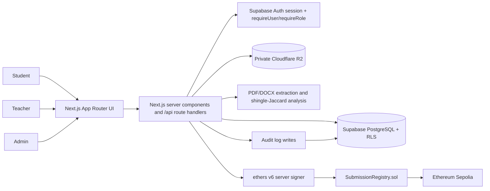
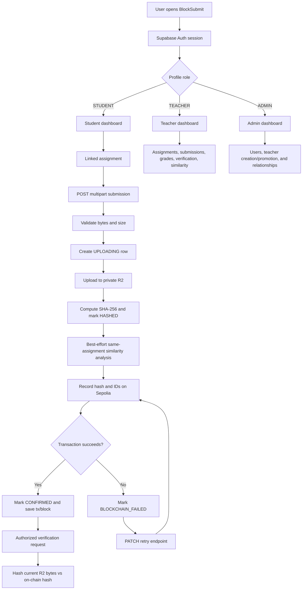

# BlockSubmit

BlockSubmit is a Next.js academic submission platform that stores documents privately, records server-generated integrity fingerprints on Ethereum Sepolia, and provides role-controlled submission, grading, verification, audit, and similarity workflows.

## 1. Introduction

- BlockSubmit gives students a controlled place to submit assignment documents and gives teachers a workspace for reviewing and grading them.
- It separates document storage from integrity proof: files remain in private Cloudflare R2 storage while a SHA-256 fingerprint and identifying metadata are recorded on-chain.
- Students, teachers, and administrators use different role-protected areas of the application.
- The platform's main purpose is to make submission history and file integrity easier to inspect without putting document contents on a blockchain.
- The implementation combines Next.js server routes, Supabase Auth/PostgreSQL/RLS, server-side file validation and hashing, private object storage, Solidity, and an independent similarity-analysis pipeline.

## 2. Key Features

### Authentication and authorization

- Supabase Auth manages authenticated sessions. Middleware refreshes the session cookie on requests.
- New signups are assigned the `STUDENT` profile role by a database trigger. Server-side `requireUser` and `requireRole` checks protect API routes and server components.
- Supabase Row Level Security (RLS) provides a second authorization layer for profiles, assignments, submissions, grades, audit logs, teacher-student links, and similarity matches.

### Assignment and submission management

- Teachers create, update, and delete their own assignments. An assignment with submissions cannot be deleted because its foreign key uses `ON DELETE RESTRICT`.
- Students can see assignments from teachers to whom an administrator has linked them, and each student can submit at most once per assignment.
- Submission status is tracked through `UPLOADING`, `STORED`, `HASHED`, `RECORDING`, `CONFIRMED`, and failure states.

### File storage and processing

- Uploads are processed in the Node.js runtime and validated from file bytes rather than trusting the browser MIME type.
- The current validator recognizes PDF, DOCX, PPTX, and generic ZIP containers, with a database/application file-size ceiling of 20 MiB by default.
- Files are stored in a private Cloudflare R2 bucket. Authorized view/download requests receive short-lived presigned URLs; URLs are not persisted in the database.

### Grading, similarity, and audit

- Teachers can create or update grades from 0 to 100 with optional feedback.
- PDF and DOCX text can be compared against other stable submissions for the same assignment using normalized five-word shingles and Jaccard similarity. Stored matches include a score, evidence phrases, algorithm version, and status.
- Similarity results are visible to the responsible teacher and administrators, not students. Upload, storage, hashing, blockchain, verification, grading, file-access, relationship, and administrative events are written to the audit log.

### Integrity and blockchain proof

- SHA-256 is computed on the server from the received file bytes. The Solidity `SubmissionRegistry` contract stores a write-once record containing hashed submission, student, and assignment identifiers plus the file hash and timestamp.
- The document itself is never sent to the blockchain. Verification downloads the current R2 object, recomputes its hash, and compares it with the on-chain hash.
- Blockchain failures leave the stored file and hash available for retry from `BLOCKCHAIN_FAILED` or `RECORDING`; the contract and application checks are designed to avoid duplicate records.

## 3. Technology Stack

| Layer | Technology | Purpose |
|---|---|---|
| Frontend | React 18.3, Next.js App Router | Role-based pages, forms, dashboards, and submission views |
| Framework | Next.js 15.5.25 | Full-stack application, server components, route handlers, and middleware |
| Backend/API | Next.js Route Handlers, TypeScript 5.6 | Server-side authorization, validation, workflows, and integrations |
| Database | Supabase PostgreSQL | Profiles, assignments, submissions, grades, relationships, similarity matches, and audit logs |
| Authentication | Supabase Auth with `@supabase/ssr` | Authenticated sessions and server/browser clients |
| Storage | Cloudflare R2 through AWS SDK for S3 | Private document objects and presigned GET URLs |
| Blockchain | Solidity 0.8.24, Hardhat, ethers 6, Ethereum Sepolia | Write-once submission fingerprint registry and verification reads |
| UI/Styling | Tailwind CSS 3.4, PostCSS, `lucide-react` | Styling, responsive layouts, and icons |
| Validation and processing | Zod, Node `crypto`, `pdf-parse`, Mammoth | Request validation, SHA-256, PDF/DOCX text extraction, and similarity input |

## 4. System Architecture



- The browser communicates with Next.js pages and route handlers; it does not directly control submission status, hashes, or blockchain fields.
- Supabase Auth identifies the caller. Route handlers perform explicit role/ownership checks, while Supabase RLS scopes database reads and writes.
- Submission bytes are written to R2 after server-side validation. PostgreSQL stores the R2 object key and submission metadata, not the file contents.
- Similarity analysis is a separate best-effort path. It stores pairwise results in PostgreSQL and does not block a submission from reaching `CONFIRMED`.
- The server-held blockchain signer calls `SubmissionRegistry`; the contract stores hashes and identifiers, never the document.

## 5. Application Workflow



1. A user authenticates through Supabase and is routed to the page for the profile role.
2. A linked student selects an assignment and submits a document. The server validates the bytes, creates the submission row, uploads to R2, and records audit events.
3. The server hashes the stored payload, optionally computes same-assignment similarity matches, and sends the fingerprint plus hashed IDs to `SubmissionRegistry`.
4. Teachers review and grade submissions; students and authorized staff can request integrity verification, while similarity results remain teacher/admin-only.
5. A failed blockchain call is retryable without uploading the file again; successful submissions expose transaction metadata and an audit timeline.

## 6. User Roles

| Role | Main Responsibilities |
|---|---|
| Student | View assignments made visible through a teacher-student link, submit one document per assignment, view own submission status/file/grade, access own audit timeline, and verify own confirmed submission. |
| Teacher | Create/update/delete owned assignments, view submissions to owned assignments, grade them from 0–100, download/view files, request verification, inspect audit timelines, and view similarity matches for owned assignments. |
| Admin | Access administrative pages, create teacher invite accounts, promote existing students to teachers, create/list/delete teacher-student links, and access submissions/grades/similarity data allowed by admin policies. |

Role changes are not user-selectable during normal signup. The signup trigger creates a `STUDENT`; privileged roles are assigned through the admin routes or trusted server/database operations.

## 7. Important Workflows

### Student Workflow

1. Register or sign in through the public authentication pages. A normal registration creates a `STUDENT` profile.
2. Open the student dashboard and view assignments whose teacher has an active administrator-created relationship with the student.
3. Submit a PDF, DOCX, PPTX, or validated ZIP payload. A second submission for the same assignment is rejected by the unique database constraint.
4. Track the submission state, view or download the private file through an authorized presigned URL, and see the grade when a teacher records one.
5. Request verification for a confirmed submission to compare the current R2 bytes with the on-chain SHA-256 fingerprint. Students do not receive similarity results.

### Teacher Workflow

1. Sign in with a `TEACHER` profile and open the teacher workspace.
2. Create assignments with a title, optional description, and ISO datetime deadline; update or delete only assignments owned by that teacher.
3. Review submissions for owned assignments, access files through authorization-checked presigned URLs, and inspect the submission timeline.
4. Create or update a grade from 0 to 100 with optional feedback.
5. Request integrity verification and inspect teacher-scoped similarity matches, including scores and evidence phrases.

### Admin Workflow

1. Open the admin workspace to view administrative user, teacher, student, and relationship areas.
2. Create a teacher account through an invite link or promote an existing `STUDENT` account to `TEACHER`; an admin cannot change their own role through the promotion route.
3. Create a link between a verified teacher profile and student profile, optionally filter links by teacher or student, and remove a link when needed.
4. Unlinking affects future assignment visibility/submission eligibility but does not delete historical assignments, submissions, grades, audit records, or blockchain records.
5. Admins can also access protected operational data and similarity results according to the server checks and RLS policies.

## 8. Submission & Integrity Flow

1. `POST /api/submissions` accepts multipart form data containing `file` and `assignmentId`. The server checks the file size, reads the bytes, detects a supported content type, checks assignment visibility, and inserts an `UPLOADING` row.
2. The server sanitizes the filename, stores bytes under `submissions/{submissionId}/{sanitizedName}` in private R2, and advances the row to `STORED`. The default maximum is 20 MiB, controlled by `MAX_UPLOAD_SIZE_BYTES`.
3. SHA-256 is computed from the same server-received bytes and stored as a hexadecimal database value; the client cannot supply the authoritative hash. The row advances to `HASHED` and then `RECORDING`.
4. `lib/blockchain.ts` hashes UUID strings to `bytes32` with `keccak256`, passes the raw SHA-256 digest as `bytes32`, and calls the single-owner `SubmissionRegistry` signer on the configured chain. The contract rejects a second record for the same submission ID.
5. Verification fetches the current R2 bytes and the on-chain record, compares hashes, and returns the result. `PATCH /api/submissions/[id]/retry` recovers `RECORDING` or retries `BLOCKCHAIN_FAILED` without re-uploading.

The blockchain is an integrity anchor, not file storage or a complete audit database. It stores a submission identifier, student identifier, assignment identifier, SHA-256 digest, timestamp, and recording address.

## 9. Database / Data Model

| Entity | Important fields and purpose |
|---|---|
| `profiles` | Auth-linked user profile, name, role, student number, department, and timestamps. Roles are `STUDENT`, `TEACHER`, and `ADMIN`. |
| `assignments` | Teacher-owned title, description, deadline, and creation timestamp. |
| `submissions` | Student/assignment link, R2 key, file metadata, SHA-256 hash, lifecycle status, blockchain transaction/block, and timestamps. Unique per `(assignment_id, student_id)`. |
| `grades` | One grade per submission, teacher, marks from 0–100, optional feedback, and grading timestamp. |
| `teacher_student_links` | Admin-managed many-to-many relationship controlling student assignment visibility and new submission eligibility. |
| `audit_logs` | Actor, action, resource, JSON metadata, and creation time for operational history. |
| `submission_similarity_matches` | Canonically ordered submission pair, assignment, score, evidence JSON, algorithm version, and result status. |

```mermaid
erDiagram
    PROFILES ||--o{ ASSIGNMENTS : owns
    PROFILES ||--o{ SUBMISSIONS : submits
    ASSIGNMENTS ||--o{ SUBMISSIONS : receives
    SUBMISSIONS ||--o| GRADES : has
    PROFILES ||--o{ GRADES : writes
    PROFILES ||--o{ TEACHER_STUDENT_LINKS : teacher
    PROFILES ||--o{ TEACHER_STUDENT_LINKS : student
    PROFILES ||--o{ AUDIT_LOGS : acts
    ASSIGNMENTS ||--o{ SUBMISSION_SIMILARITY_MATCHES : contains
    SUBMISSIONS ||--o{ SUBMISSION_SIMILARITY_MATCHES : pair_a
    SUBMISSIONS ||--o{ SUBMISSION_SIMILARITY_MATCHES : pair_b

    PROFILES { uuid id PK; string role; string full_name }
    ASSIGNMENTS { uuid id PK; uuid teacher_id FK; string title; datetime deadline }
    SUBMISSIONS { uuid id PK; uuid assignment_id FK; uuid student_id FK; string status; string file_hash }
    GRADES { uuid id PK; uuid submission_id FK; uuid teacher_id FK; decimal marks }
    TEACHER_STUDENT_LINKS { uuid id PK; uuid teacher_id FK; uuid student_id FK }
    AUDIT_LOGS { uuid id PK; uuid user_id FK; string action; uuid resource_id }
    SUBMISSION_SIMILARITY_MATCHES { uuid id PK; uuid assignment_id FK; uuid submission_id_a FK; uuid submission_id_b FK; decimal similarity_score }
```

The migrations enable RLS. Students read their own submissions/grades, teachers read submissions and grades for their assignments, admins have broader access, and similarity rows have no student read policy. Submission state/hash/blockchain updates are performed by server-side service-role code rather than direct student updates.

## 10. API Overview

All protected routes use the Supabase session and server-side authorization. Mutation routes also validate the request origin and validate JSON inputs with Zod where applicable. Response shapes are intentionally summarized here rather than treated as a separate public API contract.

| Method | Endpoint | Purpose | Authentication |
|---|---|---|---|
| GET | `/api/health` | Check Supabase database, R2 bucket, and blockchain connectivity; returns `ok` or `degraded`. | Public |
| GET | `/api/assignments` | List assignments visible to the authenticated user. | Authenticated; RLS |
| POST | `/api/assignments` | Create an assignment for the current teacher. | `TEACHER` |
| PATCH | `/api/assignments/[id]` | Update an assignment owned by the current teacher. | `TEACHER`, owner |
| DELETE | `/api/assignments/[id]` | Delete an owned assignment when no submissions prevent deletion. | `TEACHER`, owner |
| GET | `/api/submissions` | List submissions, optionally filtered with `assignmentId`. | Authenticated; RLS |
| POST | `/api/submissions` | Validate, store, hash, similarity-process, and record a student submission. | `STUDENT` |
| GET | `/api/submissions/[id]/download` | Return an authorized short-lived R2 URL; `mode=view` is inline only for PDFs. | Owner, assignment teacher, or `ADMIN` |
| POST | `/api/submissions/[id]/verify` | Recompute the current R2 hash and compare it with the on-chain record. | Owner, assignment teacher, or `ADMIN` |
| PATCH | `/api/submissions/[id]/retry` | Retry or recover blockchain recording from `BLOCKCHAIN_FAILED` or `RECORDING`. | Owner, assignment teacher, or `ADMIN` |
| GET | `/api/submissions/[id]/timeline` | Return audit events for one authorized submission. | Owner, assignment teacher, or `ADMIN` |
| GET | `/api/submissions/[id]/similarity` | Return similarity matches and evidence for a submission. | Assignment teacher or `ADMIN` |
| GET | `/api/grades?submissionId=...` | Fetch the grade for one submission. | Authenticated; RLS |
| POST | `/api/grades` | Create or update a submission grade. | `TEACHER`, assignment owner |
| POST | `/api/admin/teachers` | Create an invited teacher account and return its action link. | `ADMIN` |
| GET | `/api/admin/relationships` | List relationship rows, optionally filtered by `teacherId` or `studentId`. | `ADMIN` |
| POST | `/api/admin/relationships` | Link an existing teacher profile to an existing student profile. | `ADMIN` |
| DELETE | `/api/admin/relationships/[id]` | Remove one teacher-student link. | `ADMIN` |
| PATCH | `/api/admin/users/[id]/promote` | Promote an existing student profile to teacher. | `ADMIN` |

## 11. Project Structure

```text
blocksubmit/
├── app/
│   ├── api/
│   │   ├── admin/
│   │   ├── assignments/
│   │   ├── grades/
│   │   ├── health/
│   │   └── submissions/
│   ├── admin/
│   ├── assignments/[id]/
│   ├── login/
│   ├── register/
│   ├── student/
│   ├── submissions/[id]/
│   ├── teacher/
│   ├── verify/[submissionId]/
│   ├── globals.css
│   ├── layout.tsx
│   └── page.tsx
├── components/
├── contracts/
│   └── SubmissionRegistry.sol
├── lib/
├── scripts/
│   └── deploy.ts
├── supabase/
│   └── migrations/
├── types/
│   └── index.ts
├── hardhat.config.ts
├── middleware.ts
├── next.config.mjs
├── package.json
├── package-lock.json
├── postcss.config.js
├── tailwind.config.ts
├── tsconfig.json
└── README.md
```

- `app/` contains the App Router pages and all route handlers under `app/api/`.
- `components/` contains shared forms, dashboards, status displays, audit, grading, download, verification, and similarity UI.
- `lib/` owns server authentication, Supabase clients, R2 access, file validation, hashing, blockchain calls, audit writes, text extraction, and similarity processing.
- `supabase/migrations/` is the source of the PostgreSQL schema, triggers, constraints, and RLS policies.
- `contracts/` and `scripts/` contain the Solidity registry and its Hardhat deployment script.

## 12. Prerequisites & Installation

### Prerequisites

- Git.
- Node.js and npm compatible with the repository's Next.js 15.5.25 dependencies. The repository does not pin a Node.js version in `package.json`.
- A Supabase project with Auth enabled and PostgreSQL access.
- A private Cloudflare R2 bucket and S3-compatible credentials.
- An Ethereum Sepolia JSON-RPC endpoint, a funded Sepolia deployer/signer for blockchain transactions, and a deployed `SubmissionRegistry` contract.

### Clone Repository

```bash
git clone https://github.com/Sipivishta/blocksubmit.git
cd blocksubmit
```

### Install Dependencies

```bash
npm install
```

### Environment Variables

The repository currently does not include `.env.example`. Create `.env.local` for Next.js and Hardhat using placeholders, never committed credentials, and the variable names below. Values marked optional have an in-code default or are only used in particular deployments.

| Variable | Purpose | Required |
|---|---|---|
| `NEXT_PUBLIC_SUPABASE_URL` | Supabase project URL used by browser, server, and middleware clients. | Yes |
| `NEXT_PUBLIC_SUPABASE_ANON_KEY` | Supabase publishable/anonymous key for session-scoped clients. | Yes |
| `SUPABASE_SERVICE_ROLE_KEY` | Server-only key for controlled state transitions, audit writes, similarity writes, and teacher invites. | Yes |
| `R2_ACCOUNT_ID` | Cloudflare account identifier used for R2 setup/configuration. | Documented in local deployment config; not read directly by application code |
| `R2_ACCESS_KEY_ID` | R2 S3-compatible access key. | Yes |
| `R2_SECRET_ACCESS_KEY` | R2 S3-compatible secret key. | Yes |
| `R2_BUCKET_NAME` | Private bucket containing submission objects. | Yes |
| `R2_ENDPOINT` | S3-compatible Cloudflare R2 endpoint. | Yes |
| `R2_PRESIGNED_URL_TTL_SECONDS` | Lifetime of generated download/view URLs; defaults to 300 seconds in library code. | Optional |
| `BLOCKCHAIN_RPC_URL` | JSON-RPC endpoint for the configured blockchain network. | Yes for chain operations/deployment |
| `BLOCKCHAIN_CHAIN_ID` | Chain ID passed to ethers and Hardhat; defaults to Sepolia `11155111`. | Optional |
| `BLOCKCHAIN_PRIVATE_KEY` | Server/deployment signer key. Keep server-only and secret. | Yes for chain writes/deployment |
| `BLOCKCHAIN_CONTRACT_ADDRESS` | Deployed `SubmissionRegistry` address. | Yes for application chain operations |
| `BLOCKCHAIN_EXPLORER_BASE_URL` | Explorer base used to construct transaction links; defaults to Sepolia Etherscan. | Optional |
| `MAX_UPLOAD_SIZE_BYTES` | Application upload limit; defaults to `20971520` bytes. | Optional |
| `APP_ORIGIN` | Comma-separated allowed origins for mutation origin checks. | Optional; development and Vercel fallbacks exist |
| `VERCEL_URL` | Deployment URL used as an origin fallback when present. | Optional; platform-provided |

Example with placeholders only:

```dotenv
NEXT_PUBLIC_SUPABASE_URL=https://your-project.supabase.co
NEXT_PUBLIC_SUPABASE_ANON_KEY=your_supabase_anon_key
SUPABASE_SERVICE_ROLE_KEY=your_supabase_service_role_key

R2_ACCESS_KEY_ID=your_r2_access_key_id
R2_SECRET_ACCESS_KEY=your_r2_secret_access_key
R2_BUCKET_NAME=your_private_bucket
R2_ENDPOINT=https://your_account_id.r2.cloudflarestorage.com
R2_PRESIGNED_URL_TTL_SECONDS=300

BLOCKCHAIN_RPC_URL=https://your-sepolia-rpc-endpoint
BLOCKCHAIN_CHAIN_ID=11155111
BLOCKCHAIN_PRIVATE_KEY=your_server_signer_private_key
BLOCKCHAIN_CONTRACT_ADDRESS=0xYourDeployedContractAddress
BLOCKCHAIN_EXPLORER_BASE_URL=https://sepolia.etherscan.io

MAX_UPLOAD_SIZE_BYTES=20971520
APP_ORIGIN=http://localhost:3000
```

`R2_ACCOUNT_ID` appears in the local deployment environment but is not read directly by the application source; it is useful when constructing or managing the endpoint. Do not copy any existing local secret values into documentation or source control.

### Database and external services

1. Create a Supabase project and configure Auth for the login/register flow.
2. Apply the SQL files in `supabase/migrations/` in filename order. Migration `0001_init.sql` establishes the base schema, trigger, and RLS; later migrations harden signup/roles, policies, grading, teacher-student links, and similarity storage. The migration comments reference `supabase migration up` or the Supabase SQL editor; no Supabase CLI script is defined in `package.json`.
3. Create a private R2 bucket and configure its S3-compatible endpoint and credentials. The application uploads and reads through the server-side AWS SDK and presigned URLs.
4. Compile and deploy the registry contract. The Hardhat config uses Solidity `0.8.24`, optimizer runs `200`, and an optional Sepolia network from the blockchain variables.

```bash
npm run compile
npm run deploy:sepolia
```

Set the printed contract address as `BLOCKCHAIN_CONTRACT_ADDRESS`. The deployer account needs Sepolia test ETH for a real deployment.

## 13. Running the Project

Start the development server:

```bash
npm run dev
```

Open [http://localhost:3000](http://localhost:3000). The application needs the Supabase variables for authentication and database access; submission, health, verification, and blockchain paths additionally need their configured R2 and blockchain services.

Build and start the production server:

```bash
npm run build
npm run start
```

## 14. First-Time Usage

1. Configure Supabase, R2, and blockchain environment values, apply migrations, and start the app.
2. Register a user; normal signup creates a student profile. An administrator can later promote an existing student or create a teacher invite.
3. An admin links teachers and students before the student can see that teacher's assignments.
4. A teacher creates an assignment. The linked student submits one supported document and follows its processing status.
5. The teacher reviews, grades, verifies, and inspects similarity/audit data; the student can view the grade and verify their own confirmed submission.

## 15. Security

- Supabase Auth sessions are refreshed by middleware, and protected routes independently call `requireUser`/`requireRole` with explicit ownership checks where needed.
- RLS limits database access. Direct student updates to submission state/hash/blockchain fields are not allowed; server-side service-role code owns those transitions.
- Uploads are checked from their bytes, filenames are sanitized before becoming R2 keys, file size is bounded, and private objects are exposed only through authorization-gated short-lived presigned URLs.
- Zod validates mutation payloads, mutation routes check request origins, role self-escalation is blocked by a database trigger, and service-role/private blockchain values must remain server-side.
- Verification recomputes the current object hash and compares it with the write-once on-chain record. The contract uses one configured owner signer, so signer-key protection and operational trust remain deployment responsibilities.

## 16. Development & Testing

The commands defined in `package.json` are:

| Command | Purpose |
|---|---|
| `npm run dev` | Start Next.js development mode. |
| `npm run build` | Build the Next.js application. |
| `npm run start` | Start the built Next.js application. |
| `npm run lint` | Run the configured Next.js lint command. |
| `npm run typecheck` | Run TypeScript with `tsc --noEmit`. |
| `npm run compile` | Compile the Hardhat Solidity project. |
| `npm run deploy:sepolia` | Deploy `SubmissionRegistry` through Hardhat to the configured Sepolia network. |

No test script is defined in `package.json`, and no test directory is present in the repository tree. Run linting, type checking, the Next.js build, and Hardhat compilation as the available local validation steps.

## 17. Troubleshooting

### Authentication or database errors

Check `NEXT_PUBLIC_SUPABASE_URL`, `NEXT_PUBLIC_SUPABASE_ANON_KEY`, and `SUPABASE_SERVICE_ROLE_KEY`, then confirm that migrations were applied in order and the Supabase Auth project is available.

### Upload rejected

The server validates file bytes, not only the filename or browser MIME type. Use a non-empty PDF, DOCX, PPTX, or supported ZIP under `MAX_UPLOAD_SIZE_BYTES` (20 MiB by default), and confirm that the student is linked to the assignment's teacher.

### R2 access or download failures

Verify the bucket, endpoint, access key, secret key, and presigned URL TTL. The bucket is expected to be private; the download route returns a temporary signed URL only after authorization.

### Blockchain submission remains failed

Check the RPC URL, chain ID, contract address, and server signer balance/key. Use the retry action for a submission in `BLOCKCHAIN_FAILED` or `RECORDING`; do not upload the document again.

### Build or Hardhat configuration problems

Install dependencies with `npm install`, run `npm run typecheck` and `npm run compile` separately to isolate TypeScript versus Solidity issues, and provide blockchain credentials only for commands that require a live network. Hardhat can compile without a configured Sepolia network.

## 18. Future Enhancements

The following are proposed improvements, not current capabilities:

- Add a committed `.env.example` with safe placeholders and a documented deployment checklist.
- Add automated unit/integration tests for route authorization, RLS behavior, submission state transitions, and blockchain retry recovery.
- Add operational job/queue processing for similarity analysis and blockchain recording so long-running work is not coupled to one request.
- Add managed signer rotation or a role-gated signer model instead of one contract owner key.
- Add broader document text extraction and configurable similarity policies, including PPTX support and institution-specific thresholds.